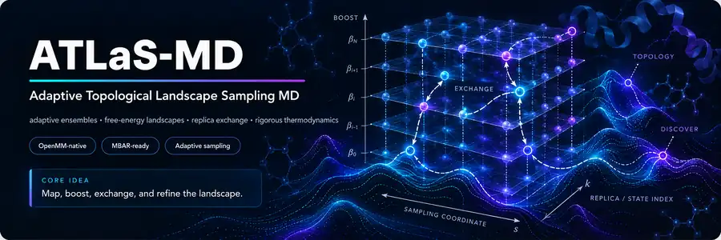
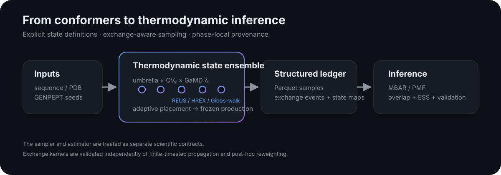

<p align="center">
  
</p>

<p align="center">
  <a href="https://github.com/sulcjo/ATLaS-MD/actions/workflows/ci.yml"></a>
  <a href="https://github.com/sulcjo/ATLaS-MD/actions/workflows/deploy-atlas-md.yml"></a>
  
  
  
  
</p>

<p align="center">
  <strong>Adaptive Topological Landscape Sampling for Molecular Dynamics</strong>
</p>

ATLaS-MD (Adaptive Topological Landscape Sampling) is an OpenMM-based workflow for exploring peptide conformational landscapes. It combines explicit-solvent molecular dynamics with collective-variable (CV) umbrella states, replica exchange, optional GaMD/Pep-GaMD acceleration, adaptive state placement, and MBAR/PMF analysis.

A run defines the peptide system and CVs, builds biased thermodynamic states, propagates replicas and attempts exchanges, then records samples and state history for analysis. Adaptive phases are tracked separately so a changing set of states is not silently treated as one fixed ensemble. ATLaS-MD helps make a simulation and its assumptions inspectable; it does not guarantee that sampling has converged or that a PMF is valid.

<p align="center">
  
</p>

## Why ATLaS-MD

| Capability | What it provides |
|---|---|
| **Umbrella sampling / REUS** | 1D and 2D biased state ensembles with explicit cross-state energy evaluation |
| **GaMD / Pep-GaMD** | Optional accelerated dynamics, including state-dependent lambda ladders |
| **Adaptive windows** | Pilot-driven refinement, sparse 2D layouts, Delaunay feedback, and epoch-based production |
| **NVT / NPT production** | Conventional OpenMM dynamics plus application-controlled NPT moves for supported boosted Hamiltonians |
| **GENPEPT seeding** | Conformer generation and CV-aware starting-state selection |
| **MBAR-ready storage** | Per-sample CVs, energies, state mappings, exchange records, and phase-local Hamiltonian metadata |
| **Reproducibility** | Checkpoints, manifests, source/input hashes, segment tracking, and restart-safe output layout |

## What a run does

1. **Build the system.** Prepare a peptide in explicit solvent, optionally using GENPEPT conformers and hydrogen-mass repartitioning (HMR).
2. **Define the landscape coordinates.** Select one or two collective variables (CVs) and place umbrella states over the region to explore.
3. **Sample and exchange.** Run OpenMM replicas with conventional MD or supported GaMD/Pep-GaMD modes; optional adaptive stages refine state placement before a separately identified production phase.
4. **Audit and analyze.** Preserve per-sample CVs, state assignments, energies, exchanges, checkpoints and provenance for MBAR/PMF analysis and overlap/ESS diagnostics.

New users can begin with the [quickstart](docs/atlas-md/start/quickstart.md), then read [how CVs and windows work](docs/atlas-md/guide/collective-variables.md) and the [analysis validity checks](docs/atlas-md/analysis/pmf-validity.md).

## Scientific contract

ATLaS-MD treats thermodynamic correctness as part of the implementation rather than an afterthought.

<p align="center">
  
</p>

Replica exchange is evaluated by cross-pricing state-dependent terms under the candidate thermodynamic states.

Elementary exchange moves are constructed to satisfy detailed balance with respect to the intended extended ensemble. Sequential exchange sweeps preserve the same stationary distribution, although a complete sweep need not itself be reversible.

For boosted NPT, supported modes use an application-controlled Metropolis volume move against the effective potential actually being propagated rather than assuming the native OpenMM barostat sees integrator-applied GaMD terms.

Read the full **[thermodynamic target and detailed-balance contract](docs/atlas-md/guide/thermodynamic-validity.md)** for the derivation, assumptions, validation scope, and remaining limitations.

## Quick start

Install the full local stack:

```bash
pip install -e ".[all]"
```

`gamd-openmm` is an external dependency required only for `gamd` / `hmr-gamd` runs.

Run a minimal peptide workflow:

```bash
gareus --seq CLN025 --out run_cln025
```

Or start from a version-controlled configuration:

```bash
gareus --write-config-template chignolin.yaml
gareus --config chignolin.yaml --seq CLN025 --out run_cln025
```

Conventional REUS without GaMD:

```bash
gareus \
  --seq CLN025 \
  --run-mode cmd \
  --window-mode adaptive \
  --out run_cmd
```

HMR + GaMD with adaptive production:

```bash
gareus \
  --seq CLN025 \
  --run-mode hmr-gamd \
  --cv1 contacts \
  --cv2 rama-map \
  --window-mode adaptive-production \
  --md-budget-ns 840 \
  --out run_adaptive
```

## Sampling modes

### Conventional MD

```bash
gareus --seq CLN025 --run-mode cmd --out run_cmd
```

Use `hmr-cmd` for the HMR convenience path.

### GaMD

```bash
gareus --seq CLN025 --run-mode gamd --out run_gamd
```

Use `hmr-gamd` for the HMR convenience path. GaMD setup/calibration is shared across replicas where the selected workflow supports it.

### 2D sampling

```bash
gareus \
  --seq CLN025 \
  --cv1 contacts \
  --cv2 rama-map \
  --window-mode adaptive-feedback \
  --out run_2d
```

### Double-adaptive sampling

```bash
gareus \
  --seq CLN025 \
  --run-mode hmr-gamd \
  --cv1 contacts \
  --cv2 rama-map \
  --window-mode double-adaptive \
  --adaptive-rounds 3 \
  --ap-epochs 10 \
  --out run_double_adaptive
```

### GENPEPT-seeded workflow

```bash
python GENPEPT.py --config chignolin.yaml

gareus \
  --config chignolin.yaml \
  --seed-conformers-dir chignolin_genpept_seeds
```

GENPEPT survivors are scored in the active CV space and audited under `us_starting_structures/`.

## Exchange modes

ATLaS-MD supports:

- `neighbor` — nearest-neighbor REUS/HREX exchange;
- `random-pair` — randomly scheduled symmetric pair exchanges;
- `all-pair-sweep` — shuffled all-pair Metropolis sweeps;
- `gibbs-walk` — long-range heat-bath-like proposals with an explicit Metropolis-Hastings correction.

The exact finite-state validation suite checks detailed balance for elementary exchange kernels and stationary invariance for their sequential compositions.

## Output model

Production output remains analyzable across adaptive changes, restart events, and long runs.

```text
run/
├── effective_config.yaml
├── run_manifest.json
├── umbrella_windows.csv
├── umbrella_explicit_windows.csv
├── segments.json
├── windows/
│   └── <segment>.json
├── samples/
│   └── <segment>/chunk_*.parquet
├── exchanges/
│   └── <segment>/chunk_*.parquet
├── exchange_tuning_report.md
└── final_run_report.md
```

**State identity is explicit and phase-local.** Analysis should not infer thermodynamic state solely from replica index or a raw local window number.

## Analysis

CLI entry point:

```bash
gareus-analyze --help
```

Python query layer:

```python
from gareus.query import load_samples, load_windows, reconstruct_bias_matrix

samples = load_samples("run_cln025")
windows = load_windows("run_cln025")

beta = 1 / (8.314462618e-3 * 300.0)
u_nk = reconstruct_bias_matrix(
    samples["cv1"],
    samples["cv2"],
    windows,
    beta,
)
```

Additional tools:

```bash
gareus-suggest-cvs --run-dir run_cln025 --print
gareus-energy-decompose --run-dir run_cln025 --out energy_decomposition.csv
```

## Resume and long runs

```bash
gareus --config chignolin.yaml --resume
```

Resume state includes exchange assignments, RNG state, production counters, segment provenance, and supported NPT-controller state. Interrupted output segments are sealed so rows beyond the last valid checkpoint are not silently reused as equilibrium data.

## Validation

Fast checks:

```bash
pytest
python -m mkdocs build --strict
```

Real workflow smoke test:

```bash
gareus-test-run --check-deps --skip-if-missing
gareus-test-run --out tiny_real_test --force
```

The validation suite includes checks for exact exchange-kernel detailed balance, Gibbs proposal/reverse-proposal correctness, lambda-ladder boost cross-evaluation, NPT acceptance algebra and molecular Jacobians, GaMD/Pep-GaMD force-group wiring, checkpoint/resume consistency, and state/window-map provenance.

Finite-timestep propagation is not claimed to be mathematically exact. The thermodynamic contract separates exact transition-kernel statements from numerical sampling accuracy and post-hoc estimator validity.

## Documentation

**[Full ATLaS-MD manual](https://github.com/sulcjo/ATLaS-MD/tree/main/docs/atlas-md)**

Useful entry points:

- [Thermodynamic validity](docs/atlas-md/guide/thermodynamic-validity.md)
- [Umbrella windows and REUS](docs/atlas-md/guide/windows-and-exchange.md)
- [GaMD](docs/atlas-md/guide/gamd.md)
- [Adaptive workflows](docs/atlas-md/guide/adaptive-workflows.md)
- [PMF validity](docs/atlas-md/analysis/pmf-validity.md)
- [Architecture](docs/atlas-md/developer/architecture.md)

Build locally:

```bash
pip install -e ".[docs]"
python -m mkdocs serve
```

## Package architecture

| Module | Responsibility |
|---|---|
| `gareus/production.py` | Production stepping, exchange, sampling, checkpoints |
| `gareus/npt.py` | Application-controlled NPT volume moves |
| `gareus/pep_gamd.py` | Pep-GaMD partitioning, lambda ladder, effective-potential adapters |
| `gareus/windows.py` | State/window construction and exchange topology |
| `gareus/adaptive_feedback.py` | Pilot-driven state refinement |
| `gareus/adaptive_production.py` | Epoch-based adaptive production and runtime budgeting |
| `gareus/cv.py` / `gareus/forces.py` | Collective variables and OpenMM forces |
| `gareus/seeding.py` | CV-aware starting-state selection |
| `gareus/store.py` / `gareus/query.py` | Parquet storage and query layer |
| `gareus/mbar_analysis/` | MBAR/PMF analysis |
| `gareus/provenance.py` | Run manifests and reproducibility metadata |
| `GENPEPT.py` | Conformer generation and seed-library construction |

## Contributing and citation

Methodological changes are expected to state their target distribution or invariant and include an independent validation route. See **[CONTRIBUTING.md](CONTRIBUTING.md)** and the dedicated thermodynamic/methodological issue template.

If ATLaS-MD contributes to published work, use the repository's **`CITATION.cff`** metadata and cite the relevant underlying methods used in the workflow.

Release history is tracked in **[CHANGELOG.md](CHANGELOG.md)**.

## Command reference

```bash
gareus -h      # operational help
gareus -hh     # extended method / option reference
```

For reproducible production work, prefer version-controlled YAML configuration over long shell commands.

---

ATLaS-MD is research software. A successful run is not, by itself, evidence of converged or statistically valid free-energy inference; coverage, overlap, effective sample size, reweighting stability, and estimator assumptions still need to be checked for every scientific conclusion.
