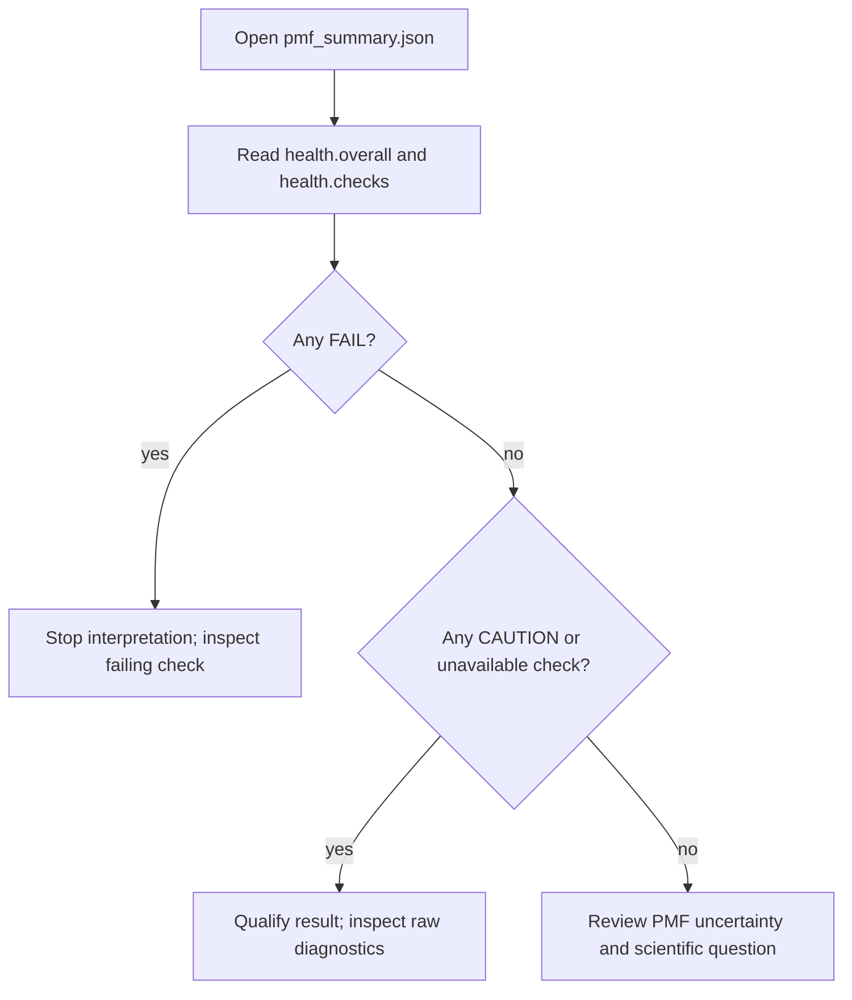

# PMF health field guide

Use this page after analysis writes `pmf_summary.md` and `pmf_summary.json`. Read `pmf_summary.json` first: it is machine-readable record of values; Markdown is human rendering of same summary.

## First five minutes

`health` is presentation-only verdict computed from analysis values. It helps triage; it does not add physics or replace protocol-specific acceptance criteria.

## Read report fields

| JSON path | Meaning | First response |
| --- | --- | --- |
| `health.overall`, `health.checks` | Composite `PASS`, `CAUTION`, `FAIL`, or `UNKNOWN`, plus check-level explanation | Start here; record exact check details |
| `n_samples`, `n_windows` | Samples actually analyzed and number of window states | Compare to expected frozen-final population |
| `mbar.converged`, `mbar.iterations`, `mbar.max_delta` | Solver self-consistency status | `False` means no PMF interpretation |
| `mbar.n_k` | Per-state analyzed sample counts | Any zero count is coverage failure |
| `mbar.active_states` | States used by solver after populated-state filtering | Compare with intended final window registry |
| `mbar.base_ess` | Effective sample size under unbiased base weights | Compare fraction `base_ess / n_samples`, not count alone |
| `neighbor_overlap` | Neighbor-pair overlap array | Find worst pair and inspect both restrained coordinates |
| `boost` | GaMD boost statistics/reweighting diagnostics when available | Check selected method and anharmonicity before trusting GaMD reweighting |
| `convergence` | PMF convergence analysis when available | Supporting evidence; cannot override coverage failure |
| `warnings`, `warnings_grouped` | Raw and triaged warnings | Preserve with report; do not suppress recurring warnings |

## Failure patterns and repair

### Zero-sample windows

`mbar.n_k` contains one or more zeros. Verdict marks window sampling `FAIL`. MBAR can omit empty states internally, but omission does not make planned state physically sampled.

Inspect state/window IDs, final registry, trajectory/sample chunk presence, and restart history. Repair with viable seed/start structure, bridge or repositioned window, then fresh sampling. Do not delete zero-count rows to obtain green report.

### Low `base_ess`

Calculate `base_ess / n_samples`. Many raw frames can collapse into few high-weight frames after unbiasing. Report uses heuristic `FAIL` below 2% and `CAUTION` below 5%; these triage labels are not universal convergence proof.

Inspect full CV support, off-target restraint behavior, GaMD boost quality, trajectory correlation, and whether final layout was frozen. More frames from same poorly supported region may not raise effective support.

### Weak neighbor overlap

For default analysis target 0.30, report marks worst overlap below 0.15 `FAIL` and 0.15–<0.30 `CAUTION`. Those are report thresholds. In 2D, diagnose CV1 **and** CV2 intersection support; CV1 histogram overlap alone cannot validate two-dimensional exchange/reweighting.

`overlap_matrix.png` shows every state at its (CV1, CV2, λ) position with pairwise MBAR overlap on each neighbour and rung edge; weak edges are red dashed. See [Overlap graph](overlap-graph.md).

Repair with bridge windows, centers on observed intersections, or restraint adjustment. Recheck explicit window table and new production samples.

### GaMD reweighting concern

When `selected_unbiased_method` is `gamd_cumulant2` or `gamd_cumulant3`, low exponential reweighting ESS is expected and does not itself fail verdict. Relevant cumulant signal is boost anharmonicity, alongside boost mean/std and PMF stability. For `gamd_exponential`, exponential ESS remains directly relevant.

Keep GaMD boost plots/reports with PMF. CMD control or fresh restrained sampling may be needed when boost distribution is non-Gaussian or weighted support collapses.

### Solver converged but health failed

`mbar.converged: true` means numerical fixed point found. It does not demonstrate unbiased coverage. A converged result with empty states, near-zero `base_ess`, or broken overlap remains scientifically unusable.

## Evidence record

For each accepted PMF, archive:

1. `pmf_summary.json` and `pmf_summary.md`.
2. `effective_config.*`, manifest, explicit window table, segments/registry metadata.
3. PMF, overlap, boost, and convergence plots named in `files`.
4. Exact analysis command, selected unbiased method, input population/epoch selection.
5. Acceptance rationale: observed coverage, worst overlap, `base_ess / n_samples`, GaMD diagnostics, and limitations.

See [PMF validity](pmf-validity.md) for overall gate and [synthetic harness](synthetic-harness.md) for oracle-based decision testing.
