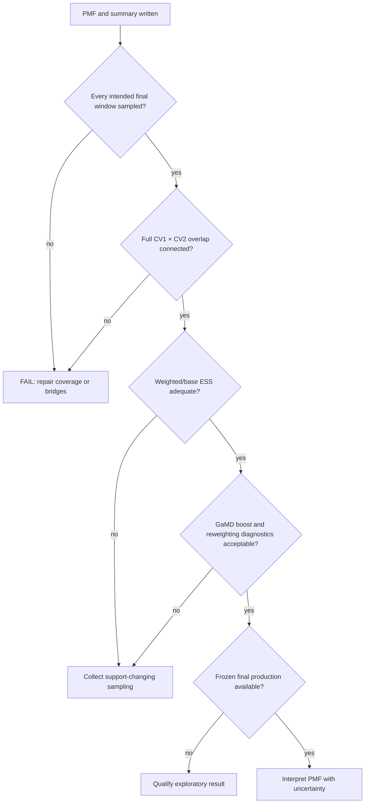

# PMF validity

## Completion is not validity

MBAR solver convergence or output files prove numerical completion, not scientific reliability. Treat composite health `FAIL` as failure even if PMF tails or solver tolerance appear converged.

## Interpretation gate

“Adequate” is study-specific; report thresholds and observed values. More frames in same off-target windows need not improve weighted support.

## Required checks

1. **Coverage:** every intended final window has samples. Empty states remain diagnostic information.
2. **Full-dimensional overlap:** assess both CV1 and CV2 restraints in 2D workflows. Good primary-CV overlap alone is insufficient.
3. **Weighted ESS:** inspect base/unbiased ESS. Millions of correlated or poorly reweighted samples can have ESS near single digits.
4. **Neighbor graph:** identify weak or missing edges; add bridge windows where needed.
5. **GaMD reweighting:** inspect boost/cumulant diagnostics, not only PMF curve smoothness.
6. **Frozen final sampling:** favor fresh final sampling after adaptive topology stops changing.
7. **Uncertainty:** use block bootstrap where available; individual-frame resampling ignores MD correlation.

## Recovery

Add bridge windows, tighten off-target secondary restraints or adjust force constants, then collect fresh frozen-final data. Do not hide zero-sample diagnostics by pruning reports; solver population filtering does not create physical overlap.

## Estimator identity

Report `umbrella_only`, `gamd_exponential`, `gamd_cumulant2`, or `gamd_cumulant3` exactly as written by analysis. They answer different numerical estimators of same target distribution. Cumulant-2 is default with usable GaMD boost; it is not direct exponential reweighting. Keep alternate estimator outputs and boost diagnostics with result. See [reweighting and estimators](reweighting.md).
