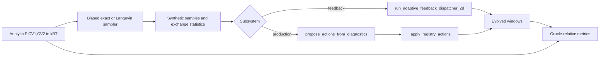

# Synthetic adaptive harness

`gareus.synth` tests adaptive-window decision logic against analytic, known free-energy surfaces. It does **not** run OpenMM, peptide force fields, GaMD, solvent, or real molecular trajectories. Use it to test/tune placement policy before consuming MD allocation; use real MD plus [PMF validity](pmf-validity.md) for physical conclusions.

## What calls real code

Harness supplies synthetic samples, exchange-statistics schema, and round/epoch glue. It calls shipped decision functions unchanged:



Feedback tests creation, movement, removal, force-constant recomputation, and 2D patches. Production tests top-up/retire behavior through `WindowStateRegistry` and policy application. Harness reimplements auto-loop glue only; it does not validate OpenMM workflow orchestration.

## Run campaigns

```bash
# Independent equilibrium samples: placement logic against oracle
python -m gareus.synth --landscape mixture-wells --mode exact \
  --subsystem feedback --rounds 5 --seed 0

# Registry top-up / retirement campaign
python -m gareus.synth --landscape mixture-wells --mode exact \
  --subsystem production --rounds 4 --seed 0

# Adversarial finite-time sampling plus diagnostic PNGs
python -m gareus.synth --landscape slow-cv2-double-branch --mode langevin \
  --subsystem feedback --rounds 5 --plot /tmp/synth_plots
```

Stdout is metrics JSON for pipes. Dispatcher diagnostics route to stderr. `numpy` is required; `scipy` and `matplotlib` are optional for some analysis/plots.

## Landscapes and samplers

| Surface | Stress case |
| --- | --- |
| `mixture-wells` | Multibasin reference case |
| `gated-barrier` | Gated transition/barrier coverage |
| `banana-valley` | Curved correlated CV support |
| `slow-cv2-double-branch` | Slow orthogonal coordinate and branch trapping |

`exact` draws independent biased equilibrium samples from `exp[-beta(F + U)]` on grid. Run it first: metric deviations point to decision logic, calibration, or oracle comparison—not trajectory correlation.

`langevin` runs short overdamped trajectories with anisotropic diffusion (`D2 << D1`). It exposes finite counts, slow-CV2 hysteresis, trapping, and false confidence. Passing exact mode does not imply Langevin robustness.

## Read metrics correctly

| Metric | Meaning |
| --- | --- |
| `economy.ratio` | Distinct CV1 windows divided by oracle minimal ladder count; near 1 is economical |
| `final_overlap` | Oracle Bhattacharyya neighboring-window overlap; smooth secondary reference |
| `dispatcher_overlap.mean` | Shipped histogram-intersection overlap; compare directly with target, usually 0.30 |
| `action_accuracy.converged_toward_ideal` | Whether distinct-window count moved toward oracle target |
| `connectivity.connected`, `spectral_gap` | Neighbor-overlap graph connectivity and path-graph Fiedler value |
| `center_churn` | Mean per-round center displacement; oscillation signal |
| `pmf_recovery.rmse_lowf_weighted` | Low-free-energy PMF error in kBT after self-consistent MBAR removes all umbrella biases |

`final_overlap` and `dispatcher_overlap` are different functionals. Do not call an oracle-overlap value evidence that dispatcher hit its histogram-intersection target. Width-dependent metrics use actual `record.k1`, not fixed default.

## Acceptance limits

Synthetic PMF recovery needs enough windows to cover both coordinates. Too few CV2 windows leave orthogonal band under-sampled even when CV1 reweighting appears good. Treat candidate calibration behavior as a lead, not production defect, until reproduced at unit-consistent force-constant scales and under relevant real-MD conditions.

Run synth tests directly:

```bash
pytest -q tests/test_synth_*.py
python -m gareus.synth --help
```
