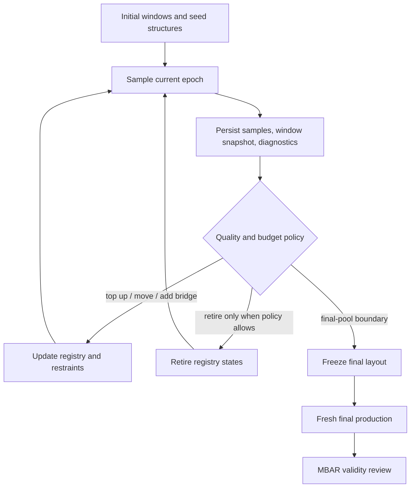

# Adaptive workflows

Adaptive modes alter window layout from sampled evidence. Keep epoch and final-pool records because final PMF should distinguish exploratory/adaptive material from frozen final production.

```bash
gareus --seq CLN025 --window-mode adaptive-production \
  --md-budget-ns 840 --ap-epochs 10 --ap-final-pool-fraction 0.50 \
  --out adaptive_pool
```

`--md-budget-ns` is aggregate pool across states/replicas. `--ap-final-pool-fraction` reserves pool for frozen final sampling.

## Epoch state machine



`adaptive-feedback` refines from pilot rounds. `adaptive-production` allocates epoch-based aggregate MD pool. `double-adaptive` runs feedback before adaptive production. Registry actions are operational decisions; validate resulting physical overlap separately.

For bootstrap-to-tICA secondary CV handoff:

```bash
gareus --config examples/chignolin_runs3.yaml --cv1 contacts --cv2 torsion-pca \
  --window-mode double-adaptive --tica-obs-interval 50 \
  --tica-update-after-epochs 0 --tica-switch-cv2 --out torsion_tica
```

Switch only after successful updated tICA state exists. Missing/unreadable state must fail closed; never relabel a CV as learned tICA without runtime projection state.
