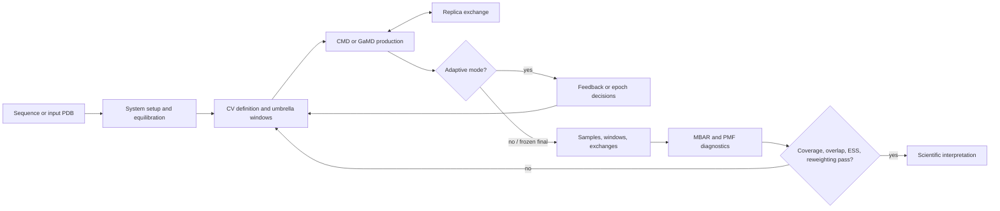

# ATLAS-MD

ATLAS-MD is manual for GAREUS: explicit-solvent peptide molecular dynamics with umbrella sampling, replica exchange (REUS), optional Gaussian accelerated MD (GaMD), adaptive window placement, and MBAR/PMF analysis.

Use it in order:

1. [Install](start/installation.md) dependencies.
2. Run [quickstart](start/quickstart.md) with conventional MD (CMD).
3. Choose [collective variables](guide/collective-variables.md) and [windows](guide/windows-and-exchange.md).
4. Read [physical/statistical foundations](guide/foundations.md) and [reweighting](analysis/reweighting.md).
5. Run analysis and apply [PMF validity](analysis/pmf-validity.md) gates before interpreting free energies.

## Scope

GAREUS is research software. It writes reproducibility artifacts and diagnostics; it does not make free-energy estimates valid by itself. Validate sampling, overlap, and reweighting for every scientific conclusion.

`F(z) = -kBT ln P(z) + C` defines reported PMFs. `C` is arbitrary; only differences within compatible analyses have physical meaning. Umbrella MBAR removes restraint bias, then GaMD runs need separate boost correction. Both operations require sampled support.

## Workflow map

Adaptive placement changes sampling plan. Freeze final layout before final inference whenever workflow supports it.

## Command map

| Command | Purpose |
| --- | --- |
| `gareus` | Main setup, equilibration, production, REUS, adaptive workflow |
| `python GENPEPT.py` | Generate and rank peptide seed conformers |
| `gareus-analyze` | MBAR/PMF analysis package entry point |
| `gareus-suggest-cvs` | Post-hoc CV/window suggestions |
| `gareus-energy-decompose` | Coordinate-based energy decomposition |
| `gareus-test-run` | Dependency checks and tiny end-to-end workflow |

See [command reference](reference/cli.md) for exact surfaces.
