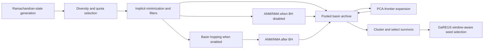
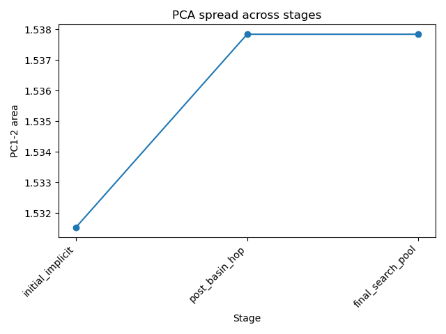
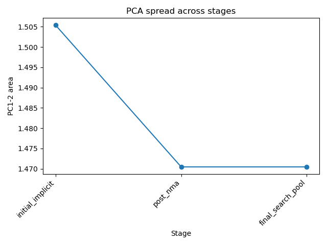
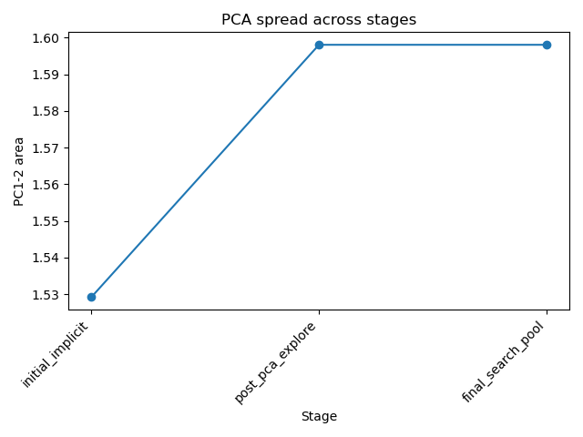
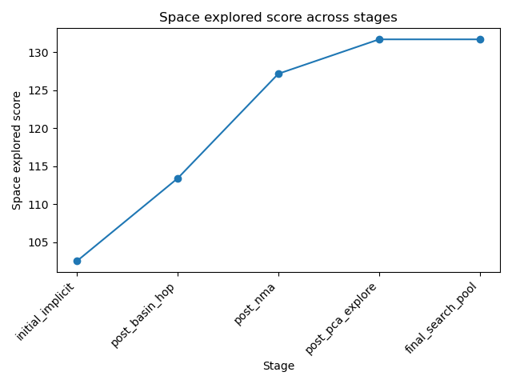
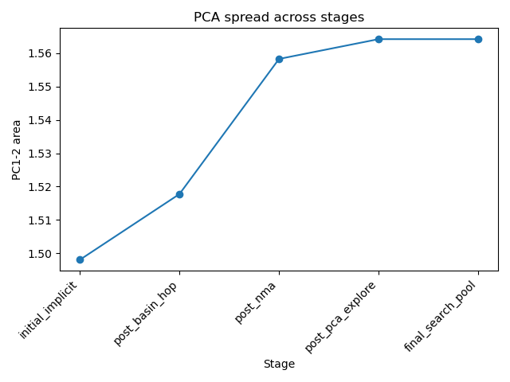
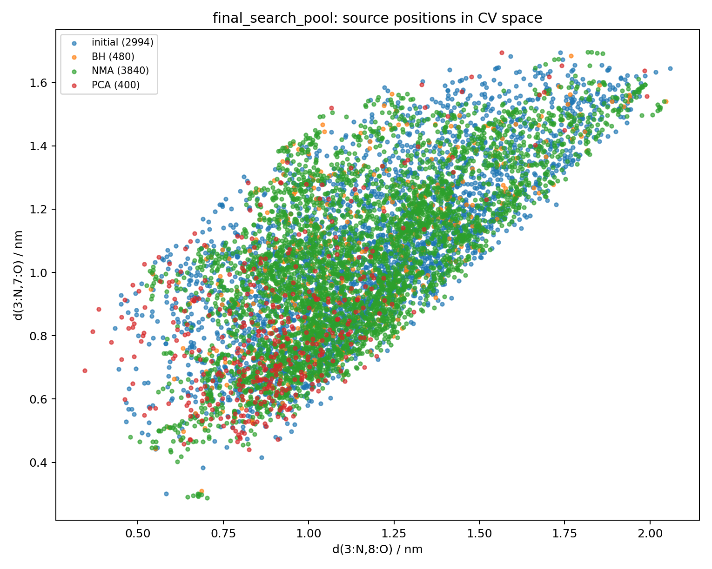
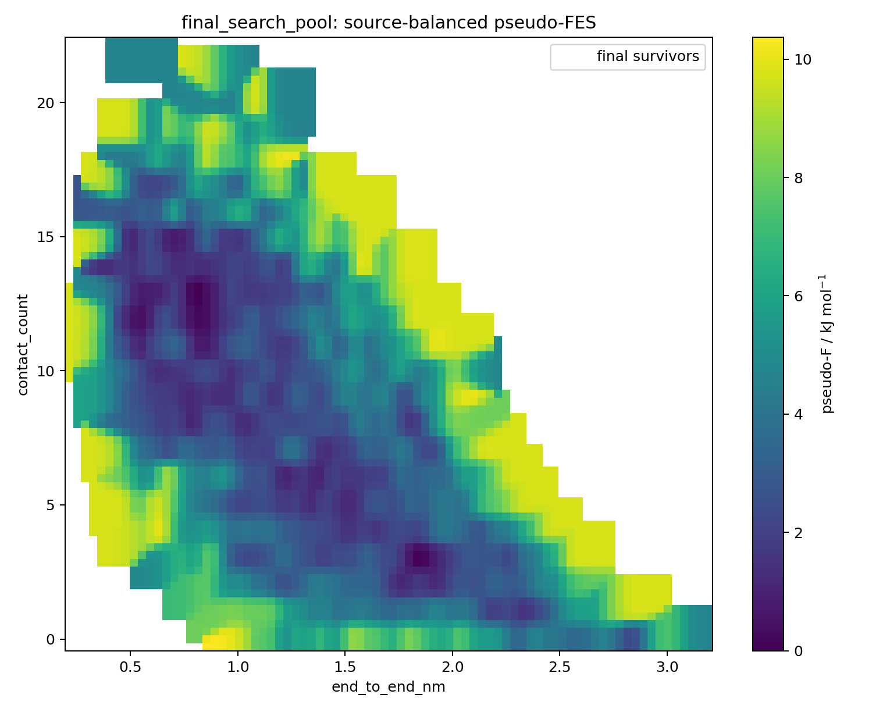

# GENPEPT Chignolin case study

This chapter explains GENPEPT through historical Chignolin exploration runs. It uses sequence `GYDPETGTWG`, controlled `run02`--`run07` artifacts, and later production-style `chignolin_genpept_r7` artifacts. Read it with [GENPEPT seeding](../guide/genpept-seeding.md), then use [Seeded 2D Chignolin](chignolin-2d.md) for GaREUS execution.

## Scientific contract

GENPEPT is a **basin-discovery and seed-generation workflow**. It creates, relaxes, perturbs, and clusters structures so GaREUS starts from more than one local conformation. It is not a Boltzmann sampler. Candidate counts, basin counts, space scores, and pseudo-FES plots are **not an equilibrium free-energy surface**, a PMF, a converged population estimate, or evidence that a GaREUS window has adequate overlap. Use [PMF validity](../analysis/pmf-validity.md) for those questions.

Historical plots document search behavior under recorded force fields, hardware, seeds, and parameters. They are diagnostic evidence, not a cross-run benchmark: controls change both enabled methods and budgets.

## Problem solved

Umbrella/REUS campaigns begin badly when every replica starts from one folded-looking PDB or when seeds cover only one CV region. GENPEPT front-loads broad, physically relaxed candidates. GaREUS then scores survivors against active CV1/CV2 targets and writes `us_starting_structures/seed_selection_report.*`. Seed diversity alone does not prove every restrained target has support.



## Chignolin experiment map

`OLD/_genpept_test/` contains method-development controls. `RUNS/chignolin_genpept_r7/` contains later production-style evidence. Manual copies selected figures so rendered docs never depend on mutable run directories.

| Run | Main contrast | Recorded pool and survivors | Lesson |
| --- | --- | --- | --- |
| `run02_raw_generation_only` | No BH, NMA, PCA | 5,000 implicit; 1,955 survivors | Generation plus implicit-relaxation baseline. |
| `run03_bh_only` | BH only | 3,500 implicit + 1,250 BH; 1,759 survivors | Short hot bursts make local escape proposals. |
| `run04_nma_only` | NMA only | 800 implicit; 1,795 survivors | One parent can make many local mode proposals. |
| `run05_minimal_full` | Small BH+NMA workflow | 1,500 implicit + 400 BH; 997 survivors | Compact all-method configuration. |
| `run06_pca_frontier_control` | PCA loop only | 1,200 implicit; 1,121 survivors | Sparse projected regions become testable proposals. |
| `run07_reasonable_all_methods` | BH+NMA+PCA | 1,800 implicit + 480 BH; 1,388 survivors | Combined control reference. |
| `chignolin_genpept_r7` | Full backend, Chignolin bank, contact bias | 2,994 implicit + 480 BH; 1,970 survivors | End-to-end output interpretation. |

Do not read survivor count as “better.” Final survivors target requested capacity and may include NMA/PCA descendants; raw budgets differ.

## Pipeline

### 1. Ramachandran-state generation

GENPEPT samples backbone states, builds structures, and rejects direct geometric clashes. `rama_sampling: stratified` spreads initial draws; `generation_backend` selects `fast` or `full`; initial diversity features (`shape`, `torsion`, `mixed`) rank broad structural variety.

Key knobs: `n`, `seed`, `angle_sd`, `rama_sampling`, `generation_backend`, `clash_cutoff`, `max_clashes`, `contact_cutoff`, and `contact_min_sep`. `r7` requested 200,000 structures with stratified sampling, full generation, 1.6 Å clash cutoff, 8 Å contact cutoff, and separation 3.

This explores *prior geometry*, not dynamics. More draws improve chance of unusual backbone/contact patterns; they never create a thermodynamic ensemble.

### 2. Diversity banks and quota preselection

Before costly OpenMM work, GENPEPT retains candidates across shape, state, torsion, contact, radius-of-gyration, and end-to-end-distance regions. `diversity_bank_preset` supplies policy; `preselection_bin_quota` prevents one dense region taking every candidate. `r7` used `chignolin`, quota 3, and `contact_bias_strength: 0.15`.

Contact bias changes **which starts are retained**, not physical weights. Treat it as exploration prior. Compare contact distributions and downstream CV support with an unbiased control before applying it to another peptide.

### 3. Implicit minimization and viability filtering

Candidate PDBs are minimized in implicit solvent, then screened for finite energy and structural criteria. Inspect `implicit_minimization_scores.csv`, `implicit_filter_table.csv`, `implicit_viable_basin_table.csv`, and `failed_implicit_minimizations.csv`. One GPU generally needs `min_jobs: 1`; more OpenMM workers can contend for device.

Key knobs: `ff`, `implicit_max_iterations`, `adaptive_min`, `adaptive_min_chunk_iterations`, `adaptive_min_energy_tol`, and `adaptive_min_force_tol`. Low viable fraction means inspect failures, clashes, sequence, protonation, and build assumptions before increasing final-seed count.

### 4. Basin hopping

`basin_hop: true` starts from selected minima, runs short high-temperature Langevin bursts, minimizes endpoints, and records `basin_hop_minima.csv`. Hop zero is parent; later hops are proposals, not equilibrium samples. `bh_steps`, `bh_md_steps`, `bh_temperature`, `bh_friction`, `bh_timestep`, and `bh_parent_seeds` set cost and reach. `bh_restart_from_parent` makes independent local probes.

`run03_bh_only` isolates BH: 1,250 minima from 3,500 implicit candidates. Enable it when local minima look narrow; reduce temperature, steps, or parent count when outputs are duplicates or minimization failures.



*Historical `run03_bh_only` diagnostic. PCA area tracks search-pool spread in that run projection; it is not free energy or probability.*

### 5. ANM/NMA expansion

`nma_expand: true` perturbs minimized structures along selected anisotropic-network/normal modes, then relaxes proposals. It is local geometry-guided expansion, complementary to BH bursts. `nma_modes`, `nma_amplitudes`, and `nma_cutoff` set proposal count and distance. Inspect `nma_implicit_minimization_scores.csv` before trusting additions.

**BH enabled: NMA expands BH minima.** Without BH, NMA expands implicit
minima. This ordering matters: all-method runs use BH endpoints as NMA parents,
whereas `run04_nma_only` starts directly from implicit minima.

`run04_nma_only` isolates this method. Its 800 implicit parents led to 1,795 final survivors because descendants join final clustering. This does not mean 1,795 independent basins.



### 6. PCA-frontier expansion

`explore_loop: true` fits PCA to pooled relaxed structures, finds sparse/edge bins, proposes conformers toward them, minimizes proposals, and can apply BH to accepted additions. Outputs under `adaptive_pca_exploration/` include `frontier.pca_points.csv`, `frontier.pca_target_bins.csv`, `pca_frontier_kept_proposals.csv`, and `adaptive_pca_added_minimization_scores.csv`.

This is adaptive coverage expansion in an **internal projection**. PCA bins are not GaREUS CV windows. Verify gained regions are viable, distinct, and useful under active CV1/CV2 restraints.

`run06_pca_frontier_control` removes BH/NMA to isolate frontier behavior. `run07_reasonable_all_methods` combines all methods.







*These are historical coverage diagnostics. Space score and PCA area depend on features, projection, and archive; compare only compatible runs.*

### 7. Pool, cluster, and final survivor selection

GENPEPT pools viable implicit, BH, NMA, and PCA-frontier minima. Basin archive tables (`*_points.csv`, `*_basins.csv`, `*_summary.csv`, transition tables) preserve stage provenance. Final clustering selects broad-basin representatives into `final_survivor_seeds.csv` and PDBs. `n_final_seeds` is desired output capacity, not unique physical-state count.

Use `cluster_method`, `n_candidate_seeds`, `n_final_seeds`, and contact/shape features to tune selection. If final seeds occupy same downstream CV target, improve diversity or let GaREUS score more candidates; count alone proves nothing.

### 8. Final implicit survivors and GAREUS handoff

`two_stage: true` enables implicit minimization, optional exploration stages,
and final implicit-survivor selection. **Atomistic explicit minimization: disabled.** Current GENPEPT hands final implicit survivors to downstream
selection; it does not perform an atomistic explicit-solvent minimization
stage. SIRAH coarse-grain conversion is separate optional continuation.

```bash
python GENPEPT.py --config examples/chignolin_2d_distance_with_genpept.yaml
gareus --config examples/chignolin_2d_distance_with_genpept.yaml \
  --seed-conformers-dir chignolin_genpept_seeds
```

Combined YAML is intentional: GENPEPT reads `conformer_generation`; GaREUS uses downstream blocks. `GENPEPT_config_compatibility.json` records selected block, inherited defaults, ignored GaREUS sections, and unknown keys. `--strict-config` makes unknown GenPept-block keys fatal.

## Reading r7 evidence

`chignolin_genpept_r7` grew from 2,994 viable implicit structures/2,463 basins to 7,714 structures/3,800 basins after BH, NMA, and PCA-frontier steps. `space_explored_score` rose 131.77 → 156.09. This shows archive coverage changed under this policy. It does **not** show lower free energy, kinetics, or convergence.



*Colors/stages identify search-pool source, not ensemble population. Use it to locate method contributions.*



*Historical final-search-pool density. It visualizes descriptor coverage; never use it as PMF.*

## Output-file field guide

| Artifact | Read it for | Do not infer |
| --- | --- | --- |
| `GENPEPT_turbo_summary.json` | Recorded knobs, counts, output paths | Comparable performance across budgets. |
| `generation_config.json`, `generation_*` | Generation policy, state/contact distribution, quota behavior | Relaxed structural viability. |
| `candidate_seeds.csv` | Pre-minimization selection | Final usable seeds. |
| `implicit_minimization_scores.csv`, failures | Energy/minimization gate | Equilibrium energy ranking. |
| `basin_hop_*`, `nma_*` | Parent/proposal provenance, failures | Kinetics or trajectories. |
| `basin_archive/*` | Stage pool size, clusters, transitions | Thermodynamic entropy. |
| `pseudo_fes_*` | Search density and source coverage | PMF, free energy, state population. |
| `final_survivor_seeds.csv` | Selected handoff set | Guaranteed GaREUS target support. |
| `seed_selection_report.*` | Assignment against active targets | REUS overlap/convergence. |

## Tuning and reproducibility

| Symptom | First check | Response |
| --- | --- | --- |
| Few viable implicit structures | failures, clashes, topology | Fix build assumptions; do not hide issue with `n_final_seeds`. |
| BH duplicates | basin archive, parent traces | Reduce parents/steps or improve pre-hop diversity. |
| NMA failures | NMA score table, amplitudes | Lower `nma_amplitudes`; inspect modes/cutoff. |
| PCA grows area, no useful seeds | target bins and active CV values | Change features or stop loop; test CV1/CV2 support. |
| Contact bias dominates | contact counts vs unbiased control | Lower bias; it is policy, not correction. |
| GaREUS target unsupported | `seed_selection_report.*` | Retain/generate near missing CV region. |

Record config, compatibility report, random seed, platform/precision/device, package commit, force field, solvent model, and summaries. For current behavior, verify `GENPEPT.py --help` and schema: historical controls can lag current defaults. Next inspect GaREUS assignment reports, then use [PMF health field guide](../analysis/pmf-health-field-guide.md) after production sampling.
